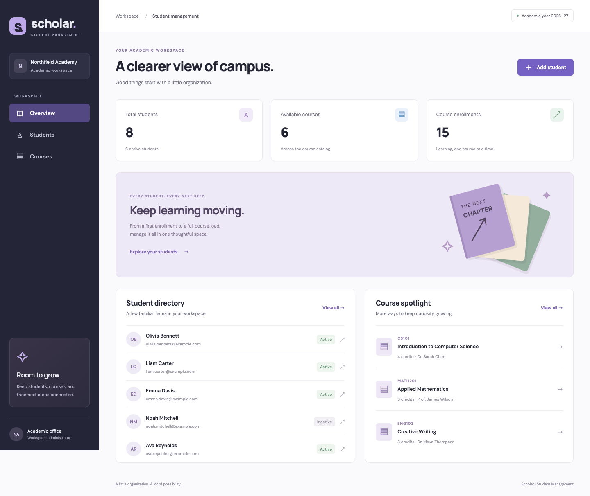

# Scholar — Student Management

An Angular 20 application for managing students, courses, and enrollments. The default setup runs against JSON Server; an optional Java 21 / Spring Boot backend implements the same API with database validation and transactions.

Vercel deployment is an additional mode. **The assignment submission still runs locally with Angular + JSON Server using `npm start`.** No Java or hosted database is required for the default workflow.



## Run locally with JSON Server

Requirements: Node.js **20.19+** (or 22.12+), npm, and two available ports: **4200** and **3000**. Java is not needed for this mode.

```bash
git clone https://github.com/h0o0bA/student-mgmt.git
cd student-mgmt
npm ci
npm start
```

Open **http://localhost:4200**. This one command starts Angular and JSON Server together; press Ctrl+C to stop both.

- Frontend: http://localhost:4200
- API: http://127.0.0.1:3000/api/students and `/api/courses`
- Health: http://127.0.0.1:3000/api/health
- Eight sample students and six courses are included. All sample names and addresses are fictional.
- The first start copies `mock/seed.json` to `mock/db.json`. Changes persist in the latter, which is intentionally excluded from Git.
- To restore sample data, **stop the server**, run `npm run db:reset`, then `npm start`. This replaces your local mock data.

To start the processes separately, use `npm run api` and `npm run serve` in two terminals. `npm run build` produces the production frontend in `dist/student-management/browser`. A production host must serve `index.html` for client routes and proxy `/api` to the chosen backend.

## Features

- **Student CRUD:** create, list, view, update, and delete profiles; search by name/email and filter by status.
- **Course CRUD:** create, list, view, update, and delete courses; search by code, title, or instructor.
- **Multiple enrollments:** add and remove courses on each student’s enrollment tab, with a credit total.
- **Routing:** lazy-loaded overview, students, courses, edit/new pages, and a 404 page. Record URLs can be opened directly.
- **Tabs and confirmation:** switching profile/enrollment tabs with unsaved edits opens a confirmation modal. Confirming switches tabs and keeps the draft; Cancel or Escape stays on the current tab. Clean forms switch immediately. Navigating to another page with unsaved changes opens a separate discard confirmation. Browser reload/close uses the browser’s native warning. Deletes also require confirmation.
- **Reactive forms:** required fields, email validation, length limits, valid status, and whole-number credits from 1–6. Email addresses and course codes must be unique, ignoring case.
- **Error handling:** loading and empty states, retry after API failures, preserved drafts after failed saves, and success notifications.
- **Component communication:** an RxJS `BehaviorSubject` store updates lists and dashboard counts after successful writes. The enrollment picker uses input/output bindings; the stats component receives inputs; dialogs and notifications use shared services.
- Responsive layouts, labeled form controls, keyboard-operable tabs, and native modal focus handling. Fonts are served locally, with their licenses in `public/fonts`.

Deleting a **student** keeps their courses. Deleting a **course** removes that course from every student and preserves the students. Inactive students retain their records and enrollments; status is a label, not a restriction on enrollment.

## Bonus: Java / Spring backend

Requirements: **JDK 21**. The checked-in Maven wrapper downloads Maven 3.9.11 on first use; a separate Maven installation is unnecessary.

```bash
cd backend
./mvnw spring-boot:run
```

On Windows, use `mvnw.cmd spring-boot:run`. If Java is not on your path, set `JAVA_HOME` to your JDK installation.

Spring runs at **http://127.0.0.1:8080**. To use it from Angular, stop the default `npm start` process, return to the project root in another terminal, and run:

```bash
npm run start:spring
```

Open http://localhost:4200 again. The proxy now directs `/api` to port 8080. The two backends have **separate data stores**; changing one does not automatically change the other.

### What the bonus includes

- Spring Boot 3.5, Spring MVC REST controllers, Spring Data JPA, and a file-backed H2 database.
- Bean Validation on request DTOs, case-insensitive uniqueness checks, database unique constraints, and enrollment foreign keys.
- Central exception handling with consistent JSON responses and meaningful 400, 404, 405, 409, 415, 502, and 503 statuses. Unexpected failures return a generic 500 message and are logged server-side.
- `@Transactional` service methods for writes. Course deletion removes enrollment links and the course in one database transaction.
- A **RestTemplate** catalog client with connect/read timeouts. The catalog import runs in a transaction, updates matching course codes without changing local IDs, and inserts new courses. If any upstream record is invalid or duplicated, the entire import rolls back.
- JUnit 5 / Mockito unit tests, RestTemplate client tests using `MockRestServiceServer`, and Spring integration tests with H2 and MockMvc. The rollback test has no surrounding test transaction, so it checks the service’s real transaction boundary.

H2 files are stored in `backend/data` when started from `backend`. Sample data is loaded only when both tables are empty. Set `--app.seed=false` to disable seeding. Settings are in `backend/src/main/resources/application.properties`; standard Spring environment variables can override them.

### Try the RestTemplate import

Keep Spring running on port 8080. In another terminal at the project root:

```bash
npm run api
```

Then:

```bash
curl -X POST http://127.0.0.1:8080/api/courses/import
```

This imports the JSON Server course catalog into Spring’s database. It does not import students, delete absent courses, or synchronize continuously. To change the upstream URL, set `APP_CATALOG_URL` before starting Spring. Reload the UI after imports made outside the browser.

## Optional Vercel deployment

The checked-in `vercel.json` defines two services under one domain:

| Service | Implementation                                   | Requests                      |
| ------- | ------------------------------------------------ | ----------------------------- |
| `web`   | Angular production build, served as static files | Pages, JavaScript, CSS, fonts |
| `api`   | Java 21 / Spring Boot container                  | `/api` and `/api/*`           |

The frontend continues to call the same relative `/api` URLs. Vercel routes them to Spring and preserves the full request path. Frontend routes fall back to `index.html`, so opening or refreshing `/students`, `/courses`, and edit URLs works. Local Angular proxy files are used only by `ng serve`.

This configuration uses Vercel **Services and Container Images, currently beta**. See the [Services documentation](https://vercel.com/docs/services) and [Container Images documentation](https://vercel.com/docs/functions/container-images). Preparation and local tests do not deploy the app or create a Vercel project.

### Settings to provide before deployment

1. Create a dedicated hosted **PostgreSQL** database. The Vercel profile requires PostgreSQL; it never falls back to H2 or local JSON files. Use a separate database for preview deployments to keep preview edits out of production data.
2. Import this repository into Vercel with the **repository root** as the Root Directory. The per-service build settings are already in `vercel.json`; use Node.js 22 for the Angular build. The backend Dockerfile supplies Java and Maven.
3. Add the following server-side environment variables in Vercel for each environment you intend to deploy. An example is in `backend/.env.example`.

| Variable            | Value                                                        |
| ------------------- | ------------------------------------------------------------ |
| `PORT`              | `8080` — Vercel must forward container requests to this port |
| `DATABASE_JDBC_URL` | `jdbc:postgresql://HOST:5432/DATABASE?sslmode=require`       |
| `DATABASE_USERNAME` | The database username                                        |
| `DATABASE_PASSWORD` | The database password                                        |
| `CATALOG_API_URL`   | Optional HTTPS URL of a reachable JSON Server course catalog |

Use a **JDBC** URL, not a `postgres://` or `postgresql://` connection string. Keep credentials in Vercel environment settings. Do not put them in frontend code, `vercel.json`, or Git. Spring's `vercel` profile is selected automatically by the container.

4. When ready, deploy from Vercel. Afterward, `/api/health` should report `Spring Boot`. Create a course, create a student with that course, refresh the page, and verify the saved enrollment.

Flyway creates the PostgreSQL schema on first startup and tracks migrations; Hibernate validates the schema instead of modifying it. The connection pool is limited to three connections per function instance. Cloud seeding is disabled, so a new deployment starts with an empty catalog and student list. This avoids multiple instances trying to seed the same database. Local mock/H2 sample data remains unchanged.

The RestTemplate import remains available. In the cloud, set `CATALOG_API_URL` to a reachable JSON Server endpoint that returns the existing course JSON format. If it is unset, only `/api/courses/import` returns a clear 503 configuration message; regular CRUD is fully available. The local import still uses JSON Server at port 3000. JSON Server is **not** used as cloud file storage because Vercel instances cannot persist `db.json` reliably.

### Check the container locally (optional)

Requires Docker and a dedicated PostgreSQL test database. Copy `backend/.env.example` to the ignored `backend/.env`, fill in its values, then run from the repository root:

```bash
docker build -f backend/Dockerfile.vercel -t student-mgmt-api backend
docker run --name student-mgmt-api --read-only --tmpfs /tmp:rw,nosuid,size=128m \
  --env-file backend/.env -p 18080:8080 student-mgmt-api
```

Use a database host reachable **from the container**; Docker Desktop uses `host.docker.internal` to reach a database on your computer. These commands start only a local container, not a Vercel deployment.

In another terminal:

```bash
node scripts/check-deployment.cjs write
docker restart student-mgmt-api
node scripts/check-deployment.cjs verify
```

The smoke check creates temporary records, verifies that they survive a backend restart, checks validation and enrollment cleanup, and deletes its test records. It defaults to `http://127.0.0.1:18080`; override `SMOKE_BASE_URL` only for a dedicated test backend.

## Assignment requirements

| Requirement                                  | Where it is demonstrated                                                                      |
| -------------------------------------------- | --------------------------------------------------------------------------------------------- |
| Angular 20+ and RxJS                         | Angular 20 standalone components, HttpClient, and the shared observable store                 |
| CRUD for students and courses                | Student directory, course catalog, and their create/edit forms                                |
| Multiple courses per student                 | Student profile's Course enrollments tab                                                      |
| Routing                                      | Lazy-loaded pages, direct record URLs, and a 404 page                                         |
| Multiple tabs and modal confirmation         | Profile/enrollment tab-switch confirmation, unsaved navigation guard, and delete dialogs      |
| Error handling                               | Validation errors, failed API calls, retry states, and preserved drafts                       |
| Multi-component communication                | Shared RxJS store, component inputs/outputs, dialog and notice services                       |
| Form handling                                | Reactive forms for profiles and courses                                                       |
| JSON Server for CRUD on localhost            | **`npm start`** runs Angular at 4200 and JSON Server at 3000                                  |
| Java, Spring, RestTemplate bonus             | `backend/`, local H2 mode, optional PostgreSQL deployment profile, and catalog import         |
| Backend validation, exceptions, transactions | Validated DTOs, central exception handling, transactional service methods, and rollback tests |
| Backend unit tests                           | JUnit/Mockito, RestTemplate client tests, H2 integration tests, and optional PostgreSQL tests |
| GitHub and README                            | Repository source plus setup instructions for each mode                                       |

Vercel hosting is supplementary. It does not replace the required localhost JSON Server demonstration.

## API

Both backends expose this contract under `/api`:

| Method | Endpoint          | Purpose                                             |
| ------ | ----------------- | --------------------------------------------------- |
| GET    | `/students`       | List students                                       |
| GET    | `/students/{id}`  | Read a student                                      |
| POST   | `/students`       | Create a student                                    |
| PUT    | `/students/{id}`  | Replace a student’s editable fields and enrollments |
| DELETE | `/students/{id}`  | Delete a student                                    |
| GET    | `/courses`        | List courses                                        |
| GET    | `/courses/{id}`   | Read a course                                       |
| POST   | `/courses`        | Create a course                                     |
| PUT    | `/courses/{id}`   | Replace a course’s editable fields                  |
| DELETE | `/courses/{id}`   | Delete a course and its enrollment links            |
| GET    | `/health`         | Identify the running backend                        |
| POST   | `/courses/import` | Spring only: import courses using RestTemplate      |

IDs are opaque strings. Send editable fields without `id` in POST/PUT requests. Both backends return the saved record, including its ID.

Student request:

```json
{
  "firstName": "Ada",
  "lastName": "Lovelace",
  "email": "ada@example.com",
  "status": "Active",
  "courseIds": ["c1", "c2"]
}
```

Course request:

```json
{
  "code": "CS205",
  "title": "Data Structures",
  "instructor": "Dr. Chen",
  "credits": 3,
  "description": "An introduction to organizing data."
}
```

`courseIds` can be empty. Every referenced course must exist; duplicate IDs are deduplicated. JSON Server also supports validated PATCH requests, but the frontend uses PUT, which both backends support. JSON Server returns 200 on student deletion; Spring returns 204. Course deletion returns 204 in both.

## Tests and checks

```bash
npm run build       # Angular production build and strict template checks
npm test            # 10 Angular unit tests; requires Chrome
npm run test:api     # 7 JSON Server tests; isolated in-memory databases
npm run test:e2e     # 11 Playwright scenarios; local Chrome by default
```

The browser suite starts its own Angular/JSON Server instances on **4201/3001**, uses in-memory seed data, and does not touch `mock/db.json`. It covers complete student/course CRUD, multi-course enrollment, deletion cleanup, tab navigation, confirmations, validation, duplicate errors, failed saves, API recovery, direct routes, and mobile layout. If Chrome is elsewhere, configure `CHROME_BIN` for unit tests. In CI, Playwright uses its installed Chromium browser.

```bash
cd backend
./mvnw test          # 21 Java unit/client/integration tests; PostgreSQL checks skipped by default
./mvnw verify        # tests and executable JAR packaging
```

The same browser scenarios can be run against a manually started frontend using `E2E_BASE_URL=http://127.0.0.1:4202 npm run test:e2e`. Use a seeded development database; these tests create and remove temporary records and briefly edit a seed course.

GitHub Actions runs the production build, Angular unit tests, JSON Server tests, browser tests, and backend verification on pushes and pull requests.

The deployment CI job additionally runs three PostgreSQL tests, builds the actual backend container, starts it with a read-only filesystem, and checks persistence across a container restart. It runs test containers only; it never deploys to Vercel. To run the PostgreSQL checks locally, set `TEST_POSTGRES=true`, `DATABASE_JDBC_URL`, `DATABASE_USERNAME`, and `DATABASE_PASSWORD`, then run `./mvnw -Dtest=PostgresDeploymentTest test` from `backend`. **Use a dedicated test database: these tests delete application records.**

## Project layout

```text
src/app/
  core/             Models, RxJS store, HTTP errors, unsaved-changes guard
  shared/           Confirmation dialog, notifications, stats, enrollment picker
  pages/            Routed overview, student/course lists, and reactive forms
mock/               JSON Server, validation middleware, seed data, API tests
e2e/                Browser scenarios and an isolated test API
backend/            Spring Boot app, Maven wrapper, and Java tests
docs/               Application screenshot
```

The frontend uses standalone Angular components, HttpClient, RxJS, and plain CSS. The mock middleware validates writes and keeps course deletions consistent in one synchronous lowdb write. It is a local mock server, not a transactional database; Spring/H2 provides the database transaction implementation. This is a local assessment app with no authentication, authorization, or multi-user conflict resolution.

Reference documentation: [Angular version compatibility](https://angular.dev/reference/versions), [JSON Server 0.17](https://github.com/typicode/json-server/tree/v0.17.4), [Spring Boot 3.5](https://docs.spring.io/spring-boot/3.5/index.html).
